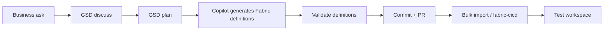

# Stop Clicking: domina Microsoft Fabric con Fabric as Code, Copilot y GSD

Repositorio de demos para la sesión **Global Fabric Day 2026 Madrid**.

La demo muestra cómo pasar de la gestión manual de Microsoft Fabric a un flujo **spec-driven**, versionado y automatizable usando:

- **Microsoft Fabric Item Definitions** como artefacto técnico desplegable.
- **GSD** como capa de contexto, especificación, planificación, ejecución y verificación.
- **GitHub Copilot / agentes** como aceleradores de generación y mantenimiento.
- **GitHub Actions** como validación y despliegue controlado.
- **Fabric REST APIs / Bulk Import** para promover cambios entre workspaces.

> Mensaje central: GSD no reemplaza las definiciones nativas de Fabric. GSD gobierna la intención, el plan y la verificación; Fabric Item Definitions materializan el despliegue.

## Demo flow



## Estructura

```text
.
├── docs/                         # Guion, arquitectura, GSD y runbooks
├── fabric-src/                   # Definiciones Fabric de demo
├── scripts/fabric/               # Autenticación, export/import y despliegue
├── scripts/demo/                 # Demo end-to-end para el evento
├── scripts/validation/           # Validaciones locales y CI
├── .github/workflows/            # GitHub Actions
├── .devcontainer/                # Entorno reproducible para VS Code
├── infra/bicep/                  # Infra auxiliar opcional
└── data/raw/                     # Datos sintéticos de ventas
```

## Requisitos

- VS Code
- Git
- PowerShell 7+
- Azure CLI
- Python 3.11+
- Permisos en Microsoft Fabric:
  - Rol Contributor o superior en los workspaces de demo.
  - Tenant setting habilitado para Service Principal si vas a ejecutar CI/CD no interactivo.
  - Aplicación Entra ID con permisos adecuados para Fabric REST API.

## Variables de entorno

Copia `.env.sample` a `.env` o configura secretos en GitHub Actions:

```bash
FABRIC_TENANT_ID=<tenant-id>
FABRIC_CLIENT_ID=<app-registration-client-id>
FABRIC_CLIENT_SECRET=<client-secret>
FABRIC_SOURCE_WORKSPACE_ID=<dev-workspace-id>
FABRIC_TARGET_WORKSPACE_ID=<test-workspace-id>
FABRIC_ITEM_ROOT=fabric-src
```

## Demo rápida local

```powershell
pwsh ./scripts/demo/00-prereqs.ps1
pwsh ./scripts/demo/01-gsd-to-fabric.ps1
pwsh ./scripts/validation/validate-repo.ps1
pwsh ./scripts/fabric/deploy-bulk-import.ps1 -DryRun
```

Para despliegue real:

```powershell
pwsh ./scripts/fabric/deploy-bulk-import.ps1 `
  -TenantId $env:FABRIC_TENANT_ID `
  -ClientId $env:FABRIC_CLIENT_ID `
  -ClientSecret $env:FABRIC_CLIENT_SECRET `
  -TargetWorkspaceId $env:FABRIC_TARGET_WORKSPACE_ID
```

## Demos incluidas

1. **Stop Clicking moment**: inspección de la solución declarativa en VS Code.
2. **GSD Discuss/Plan**: convertir requisito de negocio en plan trazable.
3. **Copilot generation**: usar instrucciones y contexto para generar un artefacto nuevo.
4. **Validation gate**: comprobar estructura mínima de item definitions y convenciones.
5. **Promotion**: dry-run o despliegue a workspace Test mediante Bulk Import API.

## Notas importantes para la sesión

- Los artefactos de `fabric-src/` son una base de demo para explicar el patrón. Para una demo 100% contra Fabric real, la ruta recomendada es exportar definiciones desde un workspace Dev conectado a Git o vía API y versionarlas en esta estructura.
- La API de Bulk Import y las Item Definition APIs pueden requerir formatos exactos por tipo de ítem. El script de despliegue está preparado para trabajar con una carpeta de definiciones exportadas desde Fabric.
- Mantén una grabación o screenshots de backup por si el tenant, permisos o throttling fallan durante la sesión.

## Licencia

MIT.
