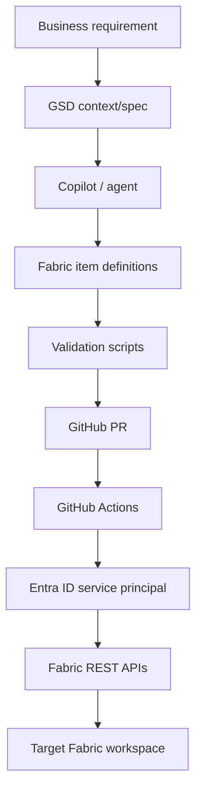

# Architecture



## Components

| Component | Responsibility |
|---|---|
| GSD docs | Maintain intent, context, decisions and execution plan. |
| Copilot instructions | Constrain AI output to repo conventions. |
| Fabric definitions | Represent deployable Fabric items. |
| Validation scripts | Fail fast on structure and convention issues. |
| GitHub Actions | Automate validation and optional promotion. |
| Fabric APIs | Create/update/import definitions into workspace. |

## Environment promotion

```text
Feature branch → PR validation → main → deploy to Test → manual approval → Prod
```
